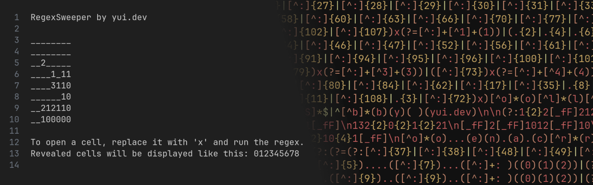

# Minesweeper in a Single Regex



Read [my blog post](https://yui.dev/blog/minesweeper-in-regex) to understand how this works!

You can try it out on the [online demo](https://yui.dev/-/regexsweeper).

# Contents

## Minesweeper

The minesweeper board & replacement pattern is baked into the regex. Run [`minesweeper.ts`](./minesweeper.ts) to generate a game:
```sh
# Usage: <width> <height> <mine count>
$ bun minesweeper.ts 15 10 20
```

This uses the dollar sign syntax (`$1`, `$2`, etc) in the replacement pattern, which is not supported everywhere. Edit the `group` and `buildRegex` functions in [`util.ts`](./util.ts) to adjust this for your text editor if it uses a different syntax.

You can check out [this file](examples/minesweeper.txt) for an example regex.

## Tic-Tac-Toe AI

I've also made a simple Tic-Tac-Toe game in Regex. You play as X against a bot who always plays perfectly. All possible board states are hardcoded into the regex.

You can take the regex from [this file](examples/tictactoe.txt), or run [`tictactoe.ts`](./tictactoe.ts) to generate it yourself.

## API

[`util.ts`](./util.ts) contains some simple tools to simplify generating regexes. Its not great, but It Works™, and its better than doing everything manually
